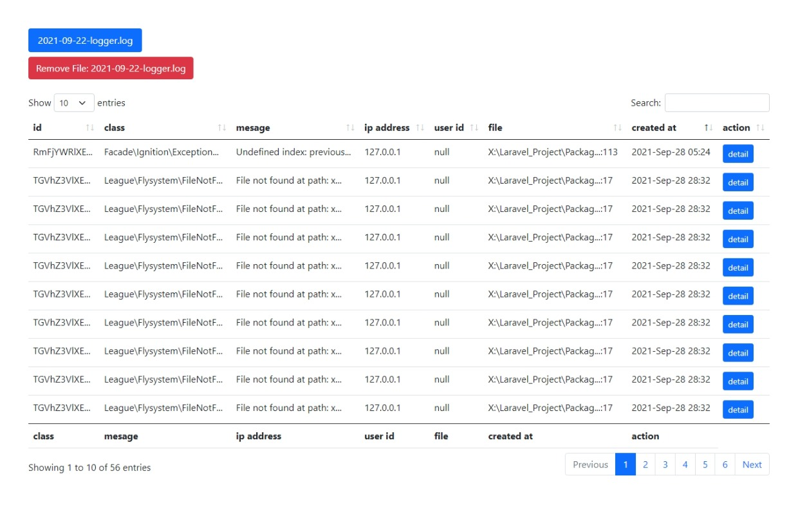

# Logger - Laravel Package For Handle Error logging

This package allow you to manage your error log in a simple way

## Screenshot



## Instalation

You may copy the code below, and paste into your project terminal, we are assuming your machine have a composer installed 

    composer require cloudmyn/logger
  
## Usage

Fisrt you have to publish the config file:

    php artisan vendor:publish --provider="CloudMyn\Logger\LoggerServiceProvider"

Goto the path **App\Exceptions\Handler.php** and add this code **Logger::log($throwable, auth()->user());** inside the report method

```PHP
<?php

namespace App\Exceptions;

use CloudMyn\Logger\Facade\Logger;
use Illuminate\Foundation\Exceptions\Handler as ExceptionHandler;

class Handler extends ExceptionHandler
{

  // ...

    /**
     * Report or log an exception.
     *
     * @param  \Throwable  $throwable
     * @return void
     *
     * @throws \Throwable
     */
    public function report(Throwable $throwable)
    {
        Logger::log($throwable, auth()->user());
        
        parent::report($throwable); // you can removed this if you want
    }
  
  // ...

}

```

Now you can visit this url **http://locahost:8000/logger/show** where the logs is listed

## List of methods

```PHP

use CloudMyn\Logger\Facade\Logger;

// Method for log an exception or error
Logger::log($throwable);

// Method for get the log files
Logger::getLogFiles();

// Method for find a log base on the given id
Logger::findById($log_filename, $id);

// Method for get the error log by id
Logger::whereId($log_filename, $id, $ignore_trace_and_prev);

// Method for get the error log by class
Logger::whereClass($log_filename, $class, $ignore_trace_and_prev);

// Method for get the error log by Message
Logger::whereMessage($log_filename, $message, $ignore_trace_and_prev);

// Method for get the error log by IP
Logger::whereIp($log_filename, $ip, $ignore_trace_and_prev);

// Method for get the error log by User Id
Logger::whereUserId($log_filename, $user_id, $ignore_trace_and_prev);

// Method for get the error log by Filename
Logger::whereFilename($log_filename, $filename, $ignore_trace_and_prev);

// Method for delete log file
Logger::delete($filename)

```
**Note:** third argument of 'where' method is determine whether the return value should be contains 'trace' and 'previous' exception or not, by default this argument is 'true', and we're encourage you to not change the default value, because this may cost your app perfomance 


